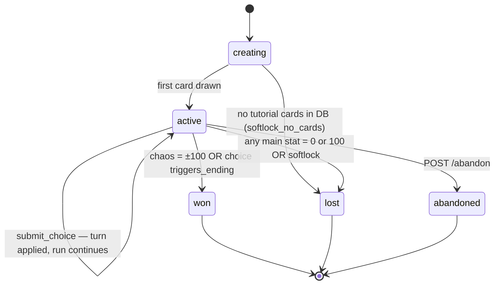
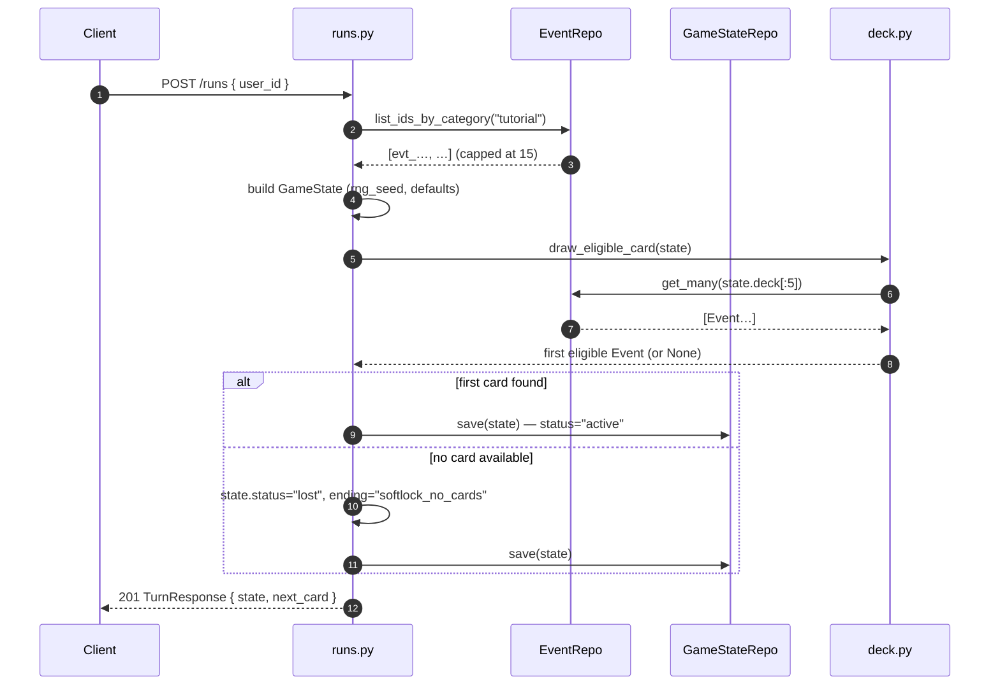
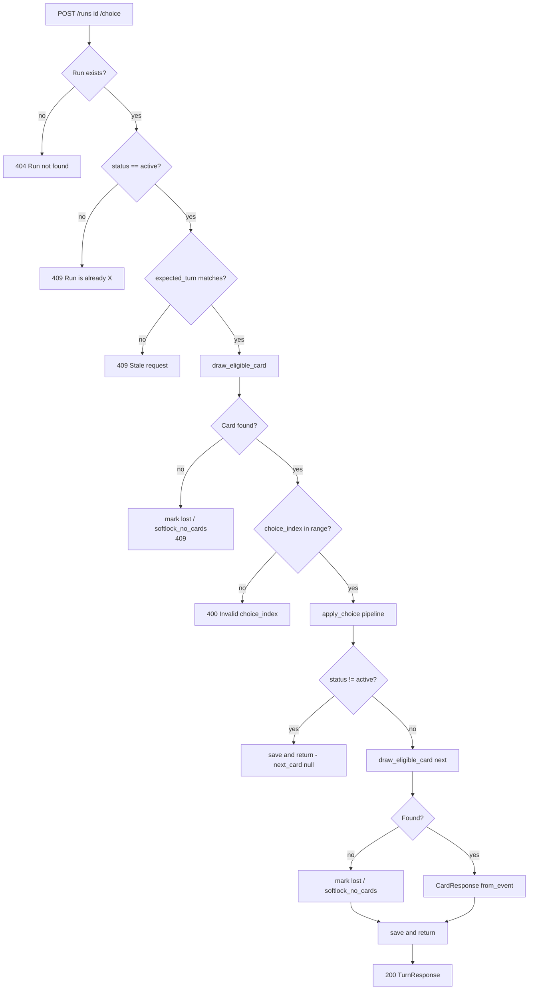
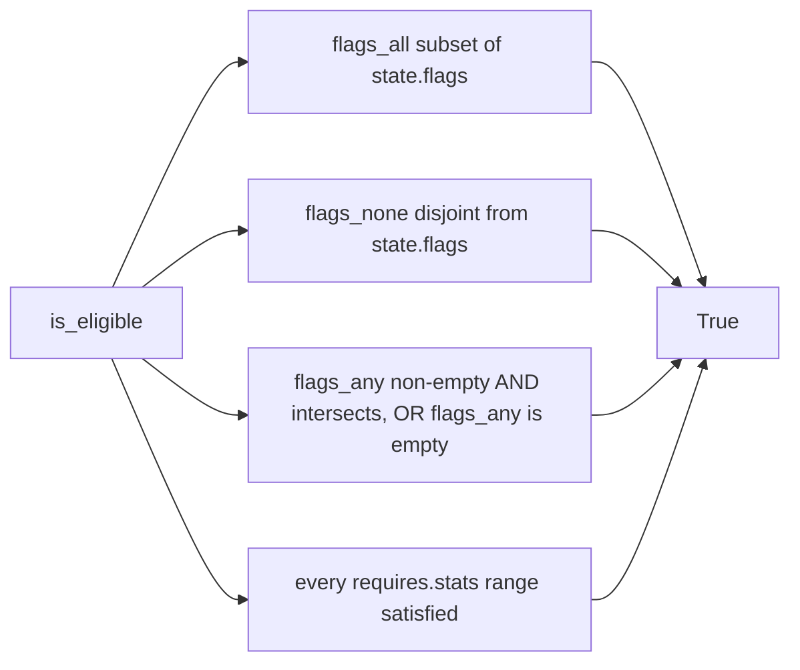
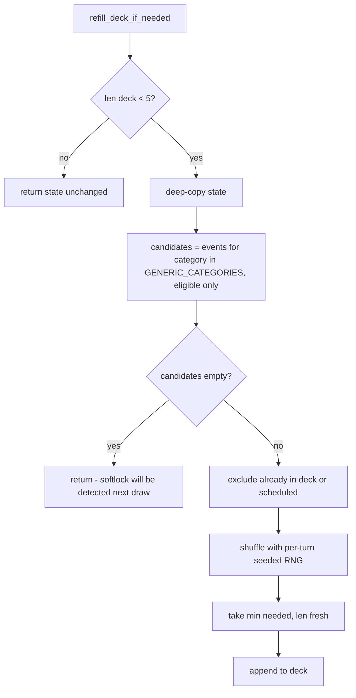

# FATCHAD — Backend Game Flow

This document describes the backend-side flow of a run, from creation to
ending. Companion to [API.md](API.md) (HTTP contract) and
[DATA_SHAPES.md](DATA_SHAPES.md) (schemas).

---

## High-level lifecycle

Once a run leaves `active`, it is read-only — gameplay endpoints reject it
with 409. The only allowed operations on an ended run are `GET /runs/{id}`,
`GET /runs/{id}/summary`, and `DELETE /runs/{id}`.

---

## Run creation — `POST /runs`

**Steps**

1. Client sends `user_id`.
2. Backend reads tutorial card IDs (cap 15), builds the initial `GameState`
   with default stats and a fresh `rng_seed`.
3. **Peek** the first eligible card without consuming — saves the client a
   second round-trip and lets us detect an empty content collection upfront.
4. State is saved exactly once. If the peek failed, the run is born `lost`.

---

## Turn — `POST /runs/{id}/choice`

The core game loop. Every turn passes through these stages, in order.

### `apply_choice` pipeline

This is the single mutation entry point inside `app/game/effects.py`. All steps
operate on a deep-copied state so failures leave the original untouched.

```mermaid
flowchart LR
    S0[Deep-copy state] --> S1[1 - consume_top_card]
    S1 --> S2[2 - apply stat effects clamped]
    S2 --> S3[3 - apply flag mutations]
    S3 --> S4[4 - tick flag timers]
    S4 --> S5[5 - apply deck additions]
    S5 --> S6[6 - history append + turn++]
    S6 --> S7[7 - promote due scheduled]
    S7 --> S8[8 - refill if low]
    S8 --> S9[9 - check_endings]
    S9 --> S10[updated_at = now]
```

**Step-by-step**

1. **`consume_top_card`** — fetch top 5 deck IDs in one Mongo query, walk
   them, find the first eligible card.
   - Cards above the drawn one:
     - `important: true`  → re-shuffled to a random position deeper in the deck
     - `important: false` → dropped
     - stale (deleted)    → dropped
   - If nothing eligible in the top 5: deck is left untouched (recoverable).
2. **Apply stat effects** — add each `effects.<stat>` delta, clamp main stats
   to `0..100` and chaos to `-100..100`.
3. **Apply flag mutations** — `sets_flags` adds (idempotent — set semantics),
   `clears_flags` removes the flag and its timer.
4. **Tick flag timers** — decrement every entry in `flag_timers`; drop the
   flag when its timer reaches zero.
5. **Apply deck additions** — for each entry in `choice.adds_to_deck`:
   - `in_turns` set → goes to `state.scheduled` with `play_on_turn = turn + N`
   - else `position`-based insert into `state.deck` (`top` / `bottom` /
     seeded random for `shuffle`)
6. **History + turn** — append `HistoryEntry`, increment `state.turn`.
7. **Promote scheduled** — any `ScheduledCard` whose `play_on_turn ≤ turn`
   gets inserted at deck position 0 (consequence lands now). Multiple cards
   due the same turn insert in LIFO order — the most recently-scheduled one
   plays first (intentional).
8. **Refill** — if `len(deck) < 5`, top up by drawing from
   `GENERIC_CATEGORIES = ["politik", "social", "economy", "chaos"]` until
   the deck reaches `DECK_TARGET_SIZE = 12`. Already-in-deck and already-
   scheduled cards are excluded. Single `$in` query.
9. **`check_endings`** — first match wins, in priority order:
   1. `choice.triggers_ending` set → `won` with that ending ID
   2. Any main stat `== 0` or `== 100` → `lost` with the matching `death_*`
   3. `chaos == 100` → `won` with `chaos_agent`
   4. `chaos == -100` → `won` with `grey_eminence`

After step 9 the new state is returned. The route then saves it and decides
whether to bundle a next card.

---

## Eligibility check — `is_eligible(card, state)`

Used by `draw_eligible_card`, `consume_top_card`, and the refill candidate
filter. Pure function. A card is eligible when **all four** of the following
hold:

Empty constraint lists are vacuously true. An unknown stat name in
`requires.stats` returns `False` — surfaces card-author bugs instead of
silently passing.

---

## Refill — keeping the deck alive

Triggered as step 8 of every turn.

`needed = DECK_TARGET_SIZE - len(deck)`. The cap means refill never overshoots
the target — even if the candidate pool is huge.

---

## Run termination paths

| End state                    | Cause                                                       |
|------------------------------|-------------------------------------------------------------|
| `won` + `chaos_agent`        | Step 9 of `apply_choice` saw `chaos == 100`                 |
| `won` + `grey_eminence`      | Step 9 saw `chaos == -100`                                  |
| `won` + *custom*             | Step 9 saw `choice.triggers_ending != null`                 |
| `lost` + `death_*`           | Step 9 saw a main stat at boundary                          |
| `lost` + `softlock_no_cards` | A draw step found nothing eligible *and* refill couldn't help |
| `abandoned`                  | Client called `POST /runs/{id}/abandon`                     |

Once non-active, the run record stays in Mongo (history preserved) until
explicitly deleted via `DELETE /runs/{id}`.

---

## Determinism

The RNG is seeded per-turn as `Random(state.rng_seed + state.turn)`. This means:

- Re-running the same turn from the same state produces the same shuffle /
  refill / `important`-reshuffle order.
- A run is *not* fully reproducible from `rng_seed` alone — choices and
  effects are also inputs — but a single turn's randomness is deterministic
  given the inputs.
- The admin `POST /admin/runs/{id}/deck` "shuffle" position is the one
  exception: it uses the global RNG since reproducibility doesn't matter for
  dev tools.
