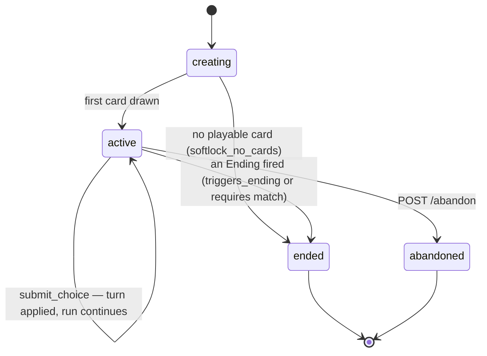
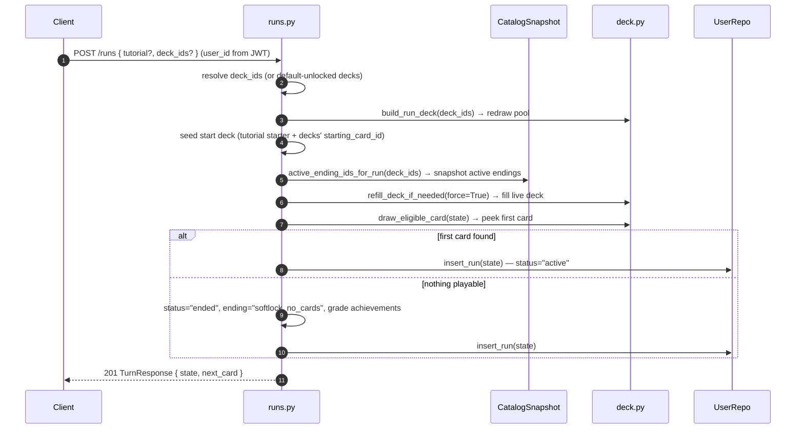
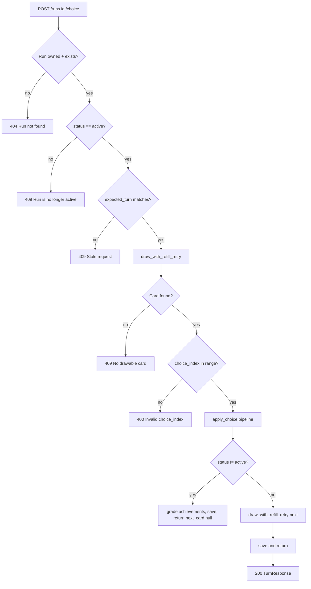
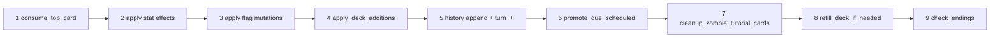
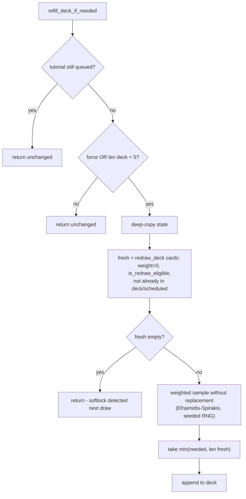

# FATCHAD — Backend Game Flow

This document describes the backend-side flow of a run, from creation to
ending. Companion to [API.md](API.md) (HTTP contract).

The engine lives in `backend/shared/game/` (`effects.py`, `deck.py`,
`endings.py`, `eligibility.py`, `requirements.py`). Card/ending/deck content is
read from a RAM-resident `CatalogSnapshot` (published S3 bundle), never from a
database query per turn.

---

## High-level lifecycle

`GameStatus` is `"active"` | `"ended"` | `"abandoned"` — there is no separate
won/lost flag. *Which* ending fired lives in the run's `ending` field (a string
id). Once a run leaves `active` it is read-only; gameplay endpoints reject it
with 409. The only allowed operations on a non-active run are `GET /runs/{id}`,
`GET /runs/{id}/history`, `GET /runs/{id}/summary`, and `DELETE /runs/{id}`.

---

## Run creation — `POST /runs`

**Steps**

1. `user_id` comes from the Cognito JWT (`sub`), never the body. The body is an
   optional `CreateRunRequest { tutorial?: bool, deck_ids?: list[str] }`.
2. Resolve which decks feed the run: explicit `deck_ids`, else every
   default-unlocked deck. Fewer than `MIN_RUN_DECKS` → 409.
3. `build_run_deck` materializes the run's **redraw pool** from those decks'
   enabled, weight>0 cards (the Tutorial deck is excluded — it enters only via
   the starter seed + its `adds_to_deck` chain). Too few cards → 409.
4. Seed the **live start deck**: the scripted tutorial starter (when
   `tutorial` is true) plus each selected deck's `starting_card_id`, all
   shuffled together with the run's seeded RNG.
5. Snapshot the run's **active ending set** (`active_ending_ids_for_run`) into
   the savestate so later admin edits to deck defaults don't change in-flight
   runs.
6. Force-refill the live deck from the redraw pool, then **peek** the first
   eligible card without consuming it. State is saved exactly once. If the peek
   fails, the run is born `ended` with `ending="softlock_no_cards"` (a softlock
   can still satisfy turn/stat achievement criteria, so they're graded first).

---

## Turn — `POST /runs/{id}/choice`

The core game loop. Every turn passes through these stages, in order.

Note the draw uses `draw_with_refill_retry`: it peeks, and if nothing is
eligible *anywhere* in the deck it recovers exactly once (force-refill →
seeded whole-deck shuffle → peek again), in memory. A still-empty result is a
real softlock.

### `apply_choice` pipeline

The single mutation entry point in `shared/game/effects.py`. Every sub-step
operates on a deep-copied state, so a failure leaves the original untouched.

**Step-by-step**

1. **`consume_top_card`** — scan the whole deck top→bottom for the first
   eligible card and pop it. Cards *above* the drawn one are resolved now:
   - `important` + `enabled` → reshuffled to a random slot (kept)
   - everything else (non-important ineligible, disabled, stale) → dropped

   With nothing eligible the deck is left unchanged so it can recover.
2. **Apply stat effects** — add each `effects.<stat>` delta. **No clamping** —
   endings (not the engine) gate out-of-band values, so a quest can drop an
   ending to lift the cap.
3. **Apply flag mutations** — `sets_flags` adds, `clears_flags` removes; clears
   win over sets within one choice. Flags are an idempotent set.
4. **`apply_deck_additions`** — for each `choice.adds_to_deck`:
   - `in_turns = N` → appended to `state.scheduled` with `play_on_turn = turn + N`
   - else `position`-based insert into `state.deck` (`top` / `bottom` /
     seeded-random `shuffle`)
5. **History + turn** — append a `HistoryEntry` (with a snapshot of the
   post-effect stats, read back by group-C achievements + the admin run view),
   then increment `state.turn`.
6. **`promote_due_scheduled`** — any `ScheduledCard` whose `play_on_turn ≤ turn`
   is inserted at deck position 0.
7. **`cleanup_zombie_tutorial_cards`** — once `tutorial_done` is set, strip any
   leftover `evt_tut_*` cards from deck and scheduled (run *before* refill so it
   doesn't waste candidate slots). No-op while the tutorial is still running.
8. **`refill_deck_if_needed`** — if `len(deck) < DECK_REFILL_THRESHOLD` (5), top
   up from the run's **`redraw_deck`** to `DECK_TARGET_SIZE` (12).
9. **`check_endings`** — data-driven (see below). May set `status="ended"` +
   `ending=<id>`, then applies this choice's `unlocks_endings` / `removes_endings`
   to the run's active ending set.

After step 9 the new state is returned. The route grades achievements + saves on
an ending, or bundles a next card and saves otherwise.

---

## Ending evaluation — `check_endings(state, choice, catalog)`

Endings are **data-driven** `Ending` records, not engine constants. Evaluated
each turn after stats/flags/deck settle, against the run's snapshotted
`active_endings` set (enabled-only):

1. If `choice.triggers_ending` is set **and** that id is in the active set →
   fire it (a quest that removed the ending wins over a card that tries to
   invoke it).
2. Otherwise, the **lowest-priority** active ending whose `requires` (flags +
   stat ranges) is satisfied fires. `min(priority)` breaks ties.
3. Either way, apply the choice's `unlocks_endings` / `removes_endings` to
   `state.active_endings` afterward (removes win over unlocks). These land
   *after* evaluation, so a card can unlock an ending without insta-firing it
   on the same play.

Threshold conditions (a stat hitting 0/100, chaos at ±100) are expressed as
ordinary `Ending` records with the appropriate `requires`/`priority` — there are
no hardcoded `death_*` / `chaos_agent` / `grey_eminence` constants in the engine.
`softlock_no_cards` is the one engine sentinel (set when no card is drawable),
not an `Ending` doc.

---

## Eligibility — `is_eligible` vs `is_redraw_eligible`

Two checks against the same `Requirements` shape (`shared/game/requirements.py`):

- **`is_eligible`** (draw time) — card must be `enabled` **and** satisfy ALL
  requirements: `flags_all` ⊆ flags, `flags_none` disjoint from flags,
  `flags_any` intersects flags (when non-empty), and every `requires.stats`
  range holds.
- **`is_redraw_eligible`** (refill time) — `enabled` + **flags only**. Stat
  ranges are deliberately ignored: a card refilled now may not surface for
  several turns, by which point stats have moved, so stats are enforced only
  when the card actually surfaces (via `is_eligible`).

Empty constraint lists are vacuously true. An unknown stat name in
`requires.stats` returns `False` — surfacing card-author bugs instead of
silently passing.

---

## Refill — keeping the deck alive

Step 8 of every turn (and forced at run start / during draw recovery).

`needed = DECK_TARGET_SIZE - len(deck)`. Candidates are sampled (never consumed)
from the run's `redraw_deck`, weighted by each card's `weight` via an
Efraimidis-Spirakis key (`rand ** (1/weight)`, take top-k). The tutorial gate
(`_tutorial_still_queued`) blocks refill while scripted tutorial cards remain in
the deck, so the tutorial plays out before the random pool kicks in.

---

## Run termination paths

| End state                     | Cause                                                        |
|-------------------------------|-------------------------------------------------------------|
| `ended` + *ending id*         | `check_endings` fired (triggers_ending or a `requires` match) |
| `ended` + `softlock_no_cards` | A draw step found nothing eligible *and* refill couldn't help |
| `abandoned`                   | Client called `POST /runs/{id}/abandon`                      |

Once non-active, the run row is preserved (history intact) until explicitly
deleted via `DELETE /runs/{id}`.

---

## Determinism

A run stores one `rng_seed`; per turn the engine derives
`turn_rng = Random(rng_seed + turn)` and threads that single stream through every
sub-step (consume reshuffle, deck additions, refill sample, recovery shuffle) so
they don't independently replay the same seed. This means a single turn's
randomness is deterministic given its inputs, though a run is not fully
reproducible from `rng_seed` alone — choices and effects are also inputs.
